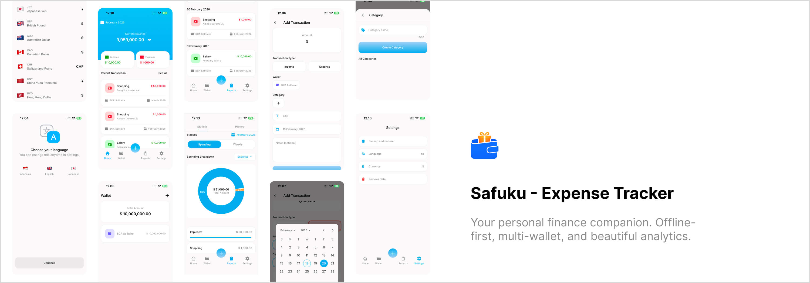

# Safuku - Expense Tracker



[](https://flutter.dev/)
[](https://dart.dev/)
[](https://pub.dev/packages/get)

## 📌 Overview

**Safuku** is a modern, offline-first expense tracker application built with Flutter. Designed for simplicity and privacy, it helps you manage your personal finances with ease without relying on cloud services. Track expenses across multiple wallets, visualize your spending habits with detailed analytics, and keep your data secure on your local device.

## ✨ Key Features

*   **💰 Expense & Income Tracking**: Easily record daily transactions with categories and notes.
*   **💳 Multi-Wallet Management**: Manage cash, bank accounts, and e-wallets in one unified view.
*   **📊 Insightful Analytics**: Visualize monthly trends and category breakdowns with interactive charts.
*   **🔒 Privacy First**: 100% offline. Your financial data stays on your device, secured with a local SQLite database.
*   **💾 Local Backup & Restore**: Securely backup your database to prevent data loss.
*   **🌍 Localization Support**: Available in English, Indonesian 🇮🇩, and Japanese 🇯🇵 with automatic currency formatting.

## 🛠 Tech Stack

*   **Framework**: [Flutter](https://flutter.dev/)
*   **Language**: [Dart](https://dart.dev/)
*   **State Management**: [GetX](https://pub.dev/packages/get)
*   **Local Database**: [sqflite](https://pub.dev/packages/sqflite)
*   **Charts**: [fl_chart](https://pub.dev/packages/fl_chart)
*   **Icons**: [font_awesome_flutter](https://pub.dev/packages/font_awesome_flutter)

## 🚀 Getting Started

### Prerequisites

*   [Flutter SDK](https://docs.flutter.dev/get-started/install) (latest stable version recommended)
*   Android Studio / VS Code with Flutter extensions
*   Git

### Installation

1.  **Clone the repository**
    ```bash
    git clone https://github.com/yourusername/safuku.git
    cd safuku
    ```

2.  **Install dependencies**
    ```bash
    flutter pub get
    ```

3.  **Run the app**
    ```bash
    flutter run
    ```

## 📂 Project Structure

```
lib/
├── config/             # App configuration (routes, themes, database)
├── core/               # Core utilities, constants, and extensions
├── data/               # Data layer (repositories, datasources, models)
├── domain/             # Domain layer (entities, usecases, repository interfaces)
├── l10n/               # Localization files (ARB)
├── ui/                 # Presentation layer (screens, controllers, widgets)
└── main.dart           # Application entry point
```


